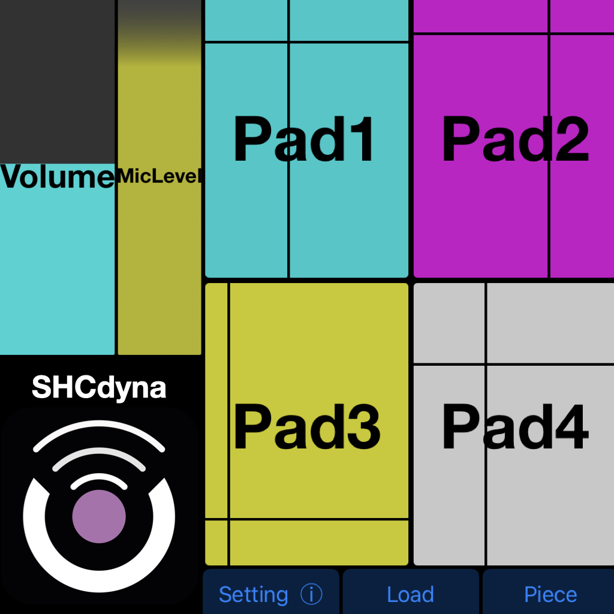

# SHCdyna

**Dynamic Compilation for Music Gesture-based SHC (Smart Hand Computer) Mobile Applications**

Developed by LiSiLoG, SHCdyna is a continuation and extension of the faust2smartphone project, first introduced at International [Faust](https://faust.grame.fr/) Conference (IFC) 2018. SHCdyna enhances the flexibility of creating musical applications through dynamic compilation, allowing musicians and developers to create, upload, and execute Faust projects in real-time on iOS devices. Building on the key concepts of customizable SHC (Smart Hand Computer) interfaces, motion control, and Faust's powerful digital signal processing (DSP) capabilities, SHCdyna opens up new possibilities for interactive music creation，workshops in education and live performance.

## Manual
[WiKi page](https://github.com/RuolunWeng/SHCdyna/wiki)

## Contact
For any questions or technical support, please contact the LiSiLoG development team.
Developers: Allen Weng & Christophe Lebreton @[LiSiLoG](https://www.lisilog.com/en)
