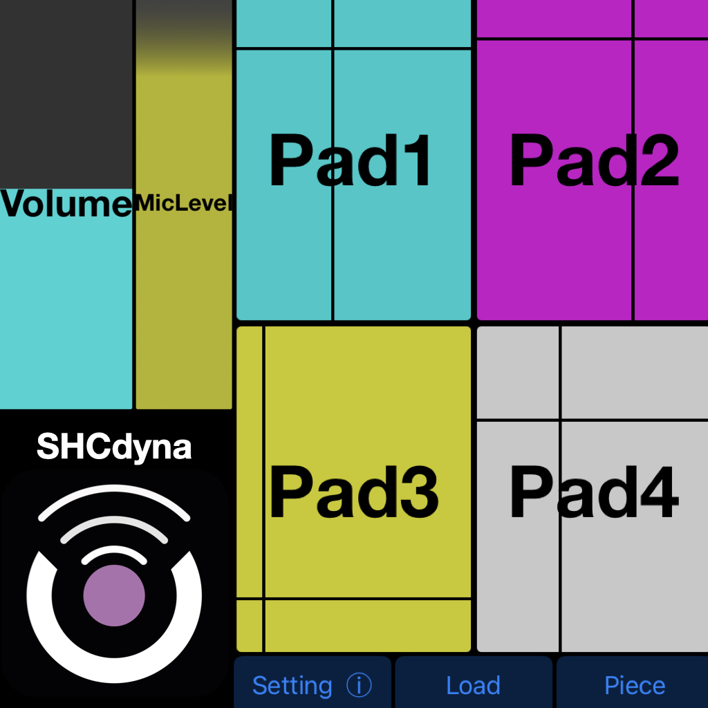
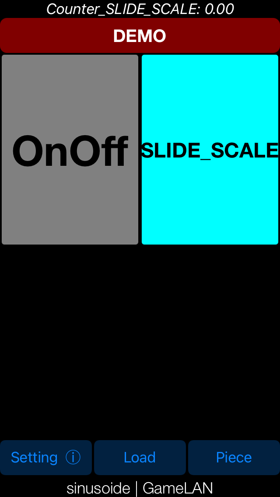
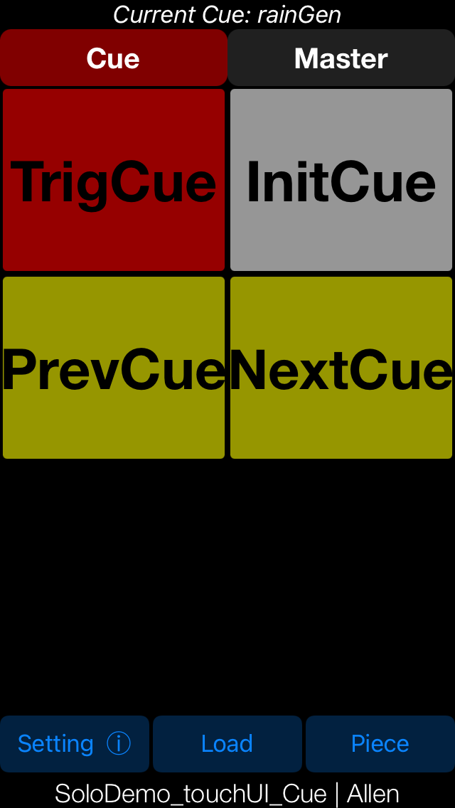
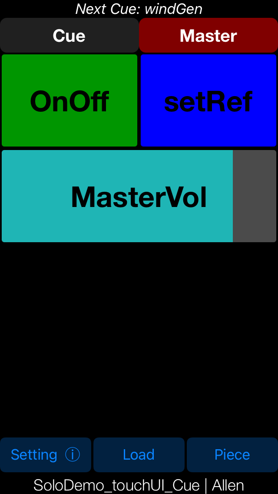

# SHCdyna


**Dynamic Compilation for Music Gesture-based SHC (Smart Hand Computer) Mobile Applications**

Developed by LiSiLoG, SHCdyna is a continuation and extension of the faust2smartphone project, first introduced at International Faust Conference (IFC) 2018. SHCdyna enhances the flexibility of creating musical applications through dynamic compilation, allowing musicians and developers to create, upload, and execute Faust projects in real-time on iOS devices. Building on the key concepts of customizable SHC (Smart Hand Computer) interfaces, motion control, and Faust's powerful digital signal processing (DSP) capabilities, SHCdyna opens up new possibilities for interactive music creation. This presentation will highlight the evolution introduced in SHCdyna and explore its potential applications in education and live performance.

## Features

### Dynamic Compilation

- **Description**: Compile and execute Faust code in real-time for a dynamic and interactive musical performance.
- **Benefits**: Easily switch from one Faust piece to another from within the application, enhancing flexibility and creativity in composition and musical performance.

### User Interface Creation: "SHCUI"

- **Description**: Create multitouch screen-based user interfaces for a personalized, intuitive, and expressive musical experience using SHCUI (Smart Hand Computer User Interface). SHCUI allows for the integration of various interactive controls, enabling real-time manipulation of sound parameters in a performance setting.

#### "SHCUI" Declaration Format

In your .dsp file, declare the required [SHCUI] interface via metadata, which will be positioned on the screen. The [SHCUI] interface types include standard types and special functions, offering extensive flexibility for interactive sound control.

**[SHCUI] Metadata Format**:
```
[SHCUI:TabTitle Type X Y W H R G B A]
```

- **TabTitle**: [SHCUI] elements can be placed in several tabs or grouped within the same tab if they share the same title.
- **X Y W H R G B A**: 
  - **X Y**: Position in % of the rectangle’s top-left corner.
  - **W H**: Width and height of the rectangle in %.
  - **R G B A**: Color and transparency of the rectangle, defined as Red/Green/Blue/Alpha values (0-255).

#### **Available [SHCUI] Types**:

- **_Standard SHCUI_**:
    - **button**: Sends 1 when pressed and automatically returns to 0 when released.
    - **checkbox**: Toggles between states 0 and 1 (off/on).
    - **hslider**: Allows horizontal movement, scaled from MIN to MAX.
    - **vslider**: Allows vertical movement, scaled from MIN to MAX.
    - **hbargraph/vbargraph**: Horizontal and vertical vumeter to visulize Faust parameters.

- **_Special SHCUI_**:
    - **trigCounter**: A trigger-like button that increments a counter in a loop (from MIN to MAX).
    - **pad**: Sends 1 when touched and provides the X and Y coordinates of the touch position. X and Y values are mapped to parameters with extensions _x / _y.
    - **setRef**: A "button" type used to initialize angular coordinates via "setRef" (rotation matrix).

- **_SHCUI Cue System_**:
    - **touchCueManager**: A default cue list from 1 to 10, which can be modified as needed.
    - **trigCue**: A button trigger used to advance in the "touchCueManager" list.
    - **nextCue**: Moves to the next position in the "touchCueManager" list when triggered by the next "trigCue".
    - **prevCue**: Moves to the previous position in the "touchCueManager" list when triggered by the next "trigCue".
    - **initCue**: Instantly initializes the position in the "touchCueManager" list.

```faust
// Example UI standard
  on_off = checkbox("[1]OnOff [SHCUI:DEMO checkbox 0 0 50 50 255 0 255 255]");
```
```faust
// Example UI speciale
  touch01X = hslider("Pad1_X",0,0,1,0.001);
  touch01Y = hslider("Pad1_Y",0,0,1,0.001);
  touchGate01 = checkbox("Pad1 [SHCUI: DEMO pad 0 0 50 50 0 255 255 200]");
```

```faust
// Example cue system
  select_sample = nentry("cue [SHCUI:DEMO trigCue 50 0 50 30 255 0 0 255] [touchCueManager: {1:'Your sample1';2:'Your sample2';3:'Your sample3'}]", 1, 1, 3, 1);
  trigNextCue = button("goNext [SHCUI: DEMO nextCue 50 30 50 30 255 255 0 150]");
  trigPrevCue = button("goPrev [SHCUI: DEMO prevCue 0 30 50 30 255 255 0 150]");
  trigInitCue = button("initCue [SHCUI: DEMO initCue 50 60 50 30 255 255 255 150]");
```


### Motion Sensing: "motion.lib"

- **Description**: Create interactions via integrated motion sensors in iOS. These descriptors can be used to modulate various audio parameters based on user movements.
  
- **Available "motion.lib" Types**: Inclinations, shock, rotation speed, angular captures...

#### "motion.lib" Declaration Format

In your .dsp file, declare the motion controllers you need as follows:
```faust
//Support for «motion.lib»
  titi = hslider("titi[motion:ixp]",0,0,1,0.01);
  toto = hslider("toto[motion:totalMotion]",0,0,1,0.01);
  tata = hslider("tata[motion:totalaccel]",0,0,1,0.01);
```
#### "motion.lib" Parameter Configuration
Double-click "Setting" to configure the "motion.lib" parameters from the application.

### Communication Management: "osc"

- **Description**: Enable interaction and remote control of audio parameters from other musical applications or vice versa. The OSC (Open Sound Control) protocol is used for network communication between musical applications.

#### "osc" Declaration Format
In your .dsp file, declare the required [osc:] interface in the metadata:
```faust
//Support for «osc»
touchGate = checkbox("SHC_Pad [SHCUI: DEMO pad 0 0 100 100 0 255 0 200] [osc:/touchgate]");
```

#### "osc" Configuration
Ensure your iOS device is connected to the same network as your computer, for example. Double-click "Setting" to configure the OSC parameters from the application.

### Additional Parameter Display: "showName"
- **Description**: Display for adjusting certain parameters via the setting user interface.
#### "showName" Declaration Format
In your .dsp file, declare the required [showName:] interface in the metadata:
```faust
//Support for «showName»
parameter = nentry("UIparamName [showName:paramName]", def, min, max, step);
```
#### "showName" Configuration
Double-click "Setting" to configure the parameters from the application.

## Installation

Download and install the SHCdyna application from the App Store.

## Usage

### Built-in Pieces
1. Double-click "Piece".
2. Double-click the SmartFaust piece to select and play.

Note: 
- You cannot delete built-in pieces.

### Create Your Instrument
1. Prepare your "yourInstrument.dsp" programmed in Faust language.
2. Compress all source files (sounds, libraries) directly into a .zip file.
3. Rename this file to "yourInstrument.FaustPiece".
4. Use AirDrop to transfer the file.
5. Double-click "Load" to search and load your .FaustPiece from SHCdyna.
6. Double-click the piece in the menu to play or delete.

Note: 
- Ensure your .FaustPiece contains at least one "yourInstrument.dsp" file with the same name as the .zip file.
- No spaces in the name of your .FaustPiece, integrated piece names are not allowed.
- Be careful to maintain consistency in names when keeping old files.
- The application will notify you of any issues encountered during the file check.

#### Demo 
- **Example_1 sinusoide**: 
  - 2 Sinusoides: "freq" et "vol" controlled by SHCdyna motion and SHCUI
  - Comcomplet code FAUST: [sinusoide.dsp](https://faustide.grame.fr/?autorun=1&voices=0&name=sinusoide&inline=ZGVjbGFyZSBuYW1lICJzaW51c29pZGUiOwpkZWNsYXJlIGF1dGhvciAiR2FtZUxBTiI7CgppbXBvcnQgKCJzdGRmYXVzdC5saWIiKTsKCi8vLS0tLS0tLS0tLS0tLS0tLS0tLS0tLS0tCi8vIE1haW4gUHJvY2VzcyBfIDIgU2ludXNvaWRlcyBfIGZyZXEgYW5kIHZvbCBjb250cm9sbGVkIGJ5IHNtYXJ0cGhvbmUgbW90aW9uCnByb2Nlc3MgPSBtb2RlX3N3aXRjaCA6IG9zLm9zYyAqIDAuMzMzICogdm9sdW1lIDw6IHNpbnVzX3JldmVyYixfIDogZHJ5X3dldCA8OiBsaW1pdGVyIDo-XyAqIG9uX29mZjsKCi8qCi0tLVNwZWNpYWwgbWV0YWRhdGEgVUkgRm9yIFNIQyBbU0hDVUldLS0tCltTSENVSTpUYWJUaXRsZSBUeXBlcyBYIFkgVyBIIFIgRyBCIEFdClRhYlRpdGxlID0%2BIGNvdWxkIGJlIHB1dCBpbiBzZXZlcmFsIHRhYnMgb3IgdGhlIHNhbWUgdGFiIGlmIHRoZXkgaGF2ZSB0aGUgc2FtZSB0aXRsZSBuYW1lClR5cGVzID0%2BICJidXR0b24iImNoZWNrYm94IiJoc2xpZGVyIiJ2c2xpZGVyIgogICAgICAgICAidHJpZ0N1ZSIibmV4dEN1ZSIicHJldkN1ZSIiaW5pdEN1ZSIic2V0UmVmIiJ0cmlnQ291bnRlciIicGFkIgpYIFkgVyBIID0%2BIGZyYW1lIENvb3JkaW5hdGlvbiBYL1k7IFdpZHRoL0hlaWdodCBbaW4gcGVyY2VudCAwLTEwMF0gClIgRyBCIEEgPT4gZnJhbWUgQ29sb3IgaW4gUmVkL0dyZWVuL0JsdWUvQWxwaGEgWzAtMjU1XQotLS0KKi8KLy8tLS0tLS0tLS0tLS0tLS0tLS0tLS0tLS0KLy8gLS0tVXBkYXRlIGZvciBTSEMgW1NIQ1VJXS0tLSAKLy8gX19fQWRkIGEgY2hlY2tib3ggYXMgYSBPTi9PRkZfXwpvbl9vZmYgPSBjaGVja2JveCgiWzFdT25PZmYgW1NIQ1VJOkRFTU8gY2hlY2tib3ggMCAwIDUwIDUwIDI1NSAwIDI1NSAyNTVdIik7Ci8vIC0tLVVwZGF0ZSBmb3IgU0hDIFtTSENVSV0tLS0gCi8vIF9fX0FkZCBhIHRyaWdDb3VudGVyIHRvIHRyaWcgYmV0d2VlbiBzb3VuZCBtb2R1bGVfc2ludXNfXwovLyBEZWZhdWx0IG1vZGUgPSBzbGlkZSAoMCkKdG9nZ2xlX21vZGUgPSBjaGVja2JveCgiWzBdU0xJREVfU0NBTEUgW1NIQ1VJOkRFTU8gdHJpZ0NvdW50ZXIgNTAgMCA1MCA1MCAwIDI1NSAyNTUgMjU1XSIpOwoKLy8tLS0tLS0tLS0tLS0tLS0tLS0tLS0tLS0KbW9kZV9zd2l0Y2ggPSBzZWxlY3QyKHRvZ2dsZV9tb2RlLCBmcmVxX3NsaWRlLCBzY2FsZSk7CmZyZXFfc2xpZGUgPSBoc2xpZGVyKCJTbGlkZSBbdW5pdDpIel1bYWNjOjAgMCAtMTAgMCAxMF1baGlkZGVuOjBdIiwgZnJlcSg1KSwgZnJlcSgwKSwgZnJlcSgxMCksIDAuMDAxKSA6IHNpLnNtb290aCgwLjk5OCk7CmZyZXFfc2NhbGUgPSBoc2xpZGVyKCJSYWRpbyBbdW5pdDpIel1bYWNjOjAgMCAtMTAgMCAxMF1baGlkZGVuOjBdIiwgMSwgMCwgKE4tMSksIDEpOwp2b2x1bWUgPSBoc2xpZGVyKCJWb2x1bWUgW2hpZGRlbjowXVthY2M6MSAwIC05IDAgMTBdIiwgMC4zNSwgMCwgMC43LCAwLjAwMSk6c2kuc21vb3RoKDAuOTkxKTptaW4oMSk6bWF4KDApOwoKCi8vLS0tLS0tLS0tLS0tLS0tLS0gRnJlcXVlbmNpZXMgLS0tLS0tLS0tLS0tLS0tLS0tLS0vLwpOID0gMTE7CnNjYWxlID0gcGFyKGksIE4sIGZyZXEoaSkgKiBjaG9pY2UoaSkpIDo%2BXzsKY2hvaWNlKG4pID0gYWJzKGZyZXFfc2NhbGUgLSBuKSA8IDAuNTsKCmZyZXEoMCkgPSA1MjMuNTsKZnJlcSgxKSA9IDU4Ny4zOwpmcmVxKDIpID0gNjIyLjM7CmZyZXEoMykgPSA3ODQ7CmZyZXEoNCkgPSA4MzAuNjsKZnJlcSg1KSA9IDEwNDYuNTsKZnJlcSg2KSA9IDExNzQuNzsKZnJlcSg3KSA9IDEyNDQuNTsKZnJlcSg4KSA9IDE1Njg7CmZyZXEoOSkgPSAxNjYxLjI7CmZyZXEoMTApID0gMjA5MzsKCi8vLS0tLS0tLS0tLS0tLS0tLS0gTGltaXRlciAtLS0tLS0tLS0tLS0tLS0tLS0tLS0tLS8vCmxpbWl0ZXIoeCx5KSA9IHgqY29lZmYseSpjb2VmZgp3aXRoIHsKICAgIGVwc2lsb24gPSAxLyg0NDEwMCoxLjApOwogICAgcGVhayA9IG1heChhYnMoeCksYWJzKHkpKSA6IG1heCB%2BIC0oZXBzaWxvbik7CiAgICBjb2VmZiA9IDEuMC9tYXgoMS4wLHBlYWspOwp9OwoKLy8tLS0tLS0tLS0tLS0tLS0tLS0gUmV2ZXJiIC0tLS0tLS0tLS0tLS0tLS0tLS0tLS0vLwpzaW51c19yZXZlcmIgPSBfPDogaW5zdHJSZXZlcmIgOj5fOwoKaW5zdHJSZXZlcmIgPSBfLF8gPDogKihyZXZlcmJHYWluKSwqKHJldmVyYkdhaW4pLCooMSAtIHJldmVyYkdhaW4pLCooMSAtIHJldmVyYkdhaW4pIDoKcmUueml0YV9yZXYxX3N0ZXJlbyhyZGVsLGYxLGYyLHQ2MGRjLHQ2MG0sZnNtYXgpLF8sXyA8OiBfLCEsXywhLCEsXywhLF8gOiArLCsKd2l0aCB7CiAgIHJldmVyYkdhaW4gPSAwLjQ7CiAgIHJvb21TaXplID0gMjsKICAgcmRlbCA9IDIwOwogICBmMSA9IDIwMDsKICAgZjIgPSA2MDAwOwogICB0NjBkYyA9IHJvb21TaXplKjM7CiAgIHQ2MG0gPSByb29tU2l6ZSoyOwogICBmc21heCA9IDQ4MDAwOwp9OwoKZHJ5X3dldCh4LHkpID0gKHgqYykgKyAoeSooMS1jKSkgd2l0aCB7CiAgICBjID0gdnNsaWRlcigiWzFdIERyeS9XZXQgTWl4IFtoaWRkZW46MV1bc3R5bGU6a25vYl0iLCAxLDAsMS4wLDAuMDEpIDogc2kuc21vbzsKfTsK)



- **Example_2 SoloDemo_SHCUI_Cue**: 
  - 3 sound generators(Sinusoide, Wind, Rain): controlled by SHCdyna Cue System and SHCUI
  - code FAUST complet: [SoloDemo_SHCUI_Cue.dsp](https://faustide.grame.fr/?autorun=1&voices=0&name=soloDemo_SHCUI_Cue&inline=ZGVjbGFyZSBuYW1lIAkJIlNvbG9EZW1vX1NIQ1VJX0N1ZSI7CmRlY2xhcmUgdmVyc2lvbiAJIjMuNyI7CmRlY2xhcmUgYXV0aG9yIAkJIkFsbGVuIjsKCgoKCnByb2Nlc3MgPSByYWluR2VuLCB3aW5kR2VuLCBzaW51c0dlbiA6Pl8sKF8gCgkJCQkJCQkJCQkJPDphdHRhY2goXyx0cmlnTmV4dEN1ZSksCgkJCQkJCQkJCQkJYXR0YWNoKF8sdHJpZ1ByZXZDdWUpLAoJCQkJCQkJCQkJCWF0dGFjaChfLHRyaWdJbml0Q3VlKSwKCQkJCQkJCQkJCQlhdHRhY2goXyx0cmlnc2V0UmVmKTo-Lyg0KSk7CgoKCi8vIGRlY2xhcmUgY29ubmVjdGlvbiBVSQpjdWVOdW0gPSBuZW50cnkoImN1ZSBbU0hDVUk6IEN1ZSB0cmlnQ3VlIDAgMCA1MCAzMCAyNTUgMCAwIDE1MF0gW3RvdWNoQ3VlTWFuYWdlcjogezA6J2luaXQnOyAxOidyYWluR2VuJzsgMjond2luZEdlbic7IDM6ICdzaW51c0dlbid9XSIsMCwwLDMsMSk7CnRyaWdOZXh0Q3VlID0gYnV0dG9uKCJnb05leHQgW1NIQ1VJOiBDdWUgbmV4dEN1ZSA1MCAzMCA1MCAzMCAyNTUgMjU1IDAgMTUwXSIpOwp0cmlnUHJldkN1ZSA9IGJ1dHRvbigiZ29QcmV2IFtTSENVSTogQ3VlIHByZXZDdWUgMCAzMCA1MCAzMCAyNTUgMjU1IDAgMTUwXSIpOwp0cmlnSW5pdEN1ZSA9IGJ1dHRvbigiaW5pdEN1ZSBbU0hDVUk6IEN1ZSBpbml0Q3VlIDUwIDAgNTAgMzAgMjU1IDI1NSAyNTUgMTUwXSIpOwoKdHJpZ3NldFJlZiA9IGJ1dHRvbigic2V0cmVmX3JvdGFbb3NjOi9zZXRSZWZdW1NIQ1VJOiBNYXN0ZXIgc2V0UmVmIDUwIDAgNTAgMjUgMCAwIDI1NSAyNTVdIik7Cgp0b3VjaEdhdGUgPSBjaGVja2JveCgiT25PZmYgW1NIQ1VJOiBNYXN0ZXIgY2hlY2tib3ggMCAwIDUwIDI1IDAgMjU1IDAgMTUwXSIpOwp2b2x1bWUgPSBoc2xpZGVyKCJNYXN0ZXJWb2wgW1NIQ1VJOiBNYXN0ZXIgaHNsaWRlciAwIDI1IDEwMCAyNSAwIDI1NSAyNTUgMTUwXSIsMCwwLDEsMC4wMSk7CnBhcmFtID0gaHNsaWRlcigicGFyYW1bbW90aW9uOkFtcFpdIiwwLDAsMSwwLjAxKTsKCgovLy0tLS0tLS0tLS0tLS0tLS0tLS0tLS1gcmFpbmAtLS0tLS0tLS0tLS0tLS0tLS0tLS0tLS0tLQovLyBBIHZlcnkgc2ltcGxlIHJhaW4gc2ltdWxhdG9yCi8vCi8vICMjIyMgVXNhZ2UKLy8KLy8gYGBgCi8vICByYWluKGQsbCkgOiBfLF8KLy8gYGBgCi8vCi8vIFdoZXJlOgovLwovLyAqIGBkYDogaXMgdGhlIGRlbnNpdHkgb2YgdGhlIHJhaW46IGJldHdlZW4gMCBhbmQgMQovLyAqIGBsYDogaXMgdGhlIGxldmVsICh2b2x1bWUpIG9mIHRoZSByYWluOiBiZXR3ZWVuIDAgYW5kIDEKLy8KLy8tLS0tLS0tLS0tLS0tLS0tLS0tLS0tLS0tLS0tLS0tLS0tLS0tLS0tLS0tLS0tLS0tLS0tLS0tLS0tCgppbXBvcnQoInN0ZGZhdXN0LmxpYiIpOwoKcmFpbihkZW5zaXR5LGxldmVsKSA9IG5vLm11bHRpbm9pc2UoMikgOiBwYXIoaSwgMiwgZHJvcCkgOiBwYXIoaSwgMiwgKihsZXZlbCkpCgl3aXRoIHsKCQlkcm9wID0gXyA8OiBAKDEpLCAoYWJzIDwgZGVuc2l0eSkgOiAqOwoJfTsKCnJhaW5HZW4gID0gCXJhaW4gKAoJCQkJaHNsaWRlcigidjpyYWluL2RlbnNpdHkgW3Nob3dOYW1lOiByYWluL2RlbnNpdHldIiwgMC4zLCAwLCAxLCAwLjAxKSwKCQkJCXBhcmFtKihjdWVOdW09PTEpKiB0b3VjaEdhdGUgKiB2b2x1bWUKCQkJCS8vaHNsaWRlcigidjpyYWluL3ZvbHVtZSIsIDAuNSwgMCwgMSwgMC4wMSkKCQkJKTsKCgovLy0tLS0tLS0tLS0tLS0tLS0tLS0tLS1gd2luZGAtLS0tLS0tLS0tLS0tLS0tLS0tLS0tLS0tLQovLyBBIHZlcnkgc2ltcGxlIHdpbmQgc2ltdWxhdG9yLCBiYXNlZCBvbiBhIGZpbHRlcmVkIHdoaXRlIG5vaXNlCi8vCi8vICMjIyMgVXNhZ2UKLy8KLy8gYGBgCi8vICB3aW5kKGYpIDogXwovLyBgYGAKLy8KLy8gV2hlcmU6Ci8vCi8vICogYGZgOiBpcyB0aGUgZm9yY2Ugb2YgdGhlIHdpbmQ6IGJldHdlZW4gMCBhbmQgMQovLwovLy0tLS0tLS0tLS0tLS0tLS0tLS0tLS0tLS0tLS0tLS0tLS0tLS0tLS0tLS0tLS0tLS0tLS0tLS0tLS0KCmltcG9ydCgic3RkZmF1c3QubGliIik7Cgp3aW5kKGZvcmNlLGxldmVsKSA9IG5vLm11bHRpbm9pc2UoMikgOiBwYXIoaSwgMiwgdmUubW9vZ192Y2ZfMmJuKGZvcmNlLGZyZXEpKSA6IHBhcihpLCAyLCAqKGZvcmNlKSkgOiBwYXIoaSwgMiwgKihsZXZlbCkpCgl3aXRoIHsKCQlmcmVxID0gKGZvcmNlKjg3KSsxIDogYmEucGlhbm9rZXkyaHo7Cgl9OwoKd2luZEdlbiA9IC8vd2luZCAoIGhzbGlkZXIoInY6d2luZC9mb3JjZSIsMC42NiwwLDEsMC4wMSkgOiBzaS5zbW9vdGggKDAuOTk3KSApOwoJCXdpbmQgKCBwYXJhbSA6IHNpLnNtb290aCAoMC45OTcpICwgdm9sdW1lICogKGN1ZU51bSA9PSAyKSAqIHRvdWNoR2F0ZSApIDsKCgovLy0tLS0tLS0tLS0tLS0tLS0tLS0tLS0tLS0tLS0tLS0tLS0tLS0tLS0tLS0tLS0tCi8vIAkJCVNpbnVzb2lkYWwgT3NjaWxsYXRvcgovLy0tLS0tLS0tLS0tLS0tLS0tLS0tLS0tLS0tLS0tLS0tLS0tLS0tLS0tLS0tLS0tCgppbXBvcnQoInN0ZGZhdXN0LmxpYiIpOwoKdm9sIAkJCT0gdm9sdW1lICogKGN1ZU51bSA9PSAzKSAqIHRvdWNoR2F0ZSA6IHNpLnNtb28gOy8vaHNsaWRlcigidm9sdW1lIFt1bml0OmRCXSIsIDAsIC05NiwgMCwgMC4xKSA6IGJhLmRiMmxpbmVhciA6IHNpLnNtb28gOwpmcmVxIAkJCT0gcGFyYW0qODgwKzQ0MDsgLy9oc2xpZGVyKCJmcmVxIFt1bml0Okh6XSIsIDEwMDAsIDIwLCAyNDAwMCwgMSk7CgpzaW51c0dlbiAJCT0gb3Mub3NjKGZyZXEpIDw6IF8qIHZvbCwgXyogdm9sOwo%3D)
 
---

## More Info
The SHCdyna application is the continuation of the Open Source project ‘faust2smartphone’. ‘faust2smartphone’ allows generating standalone iOS/Android applications for Smart Hand Computer from the same code used for SHCdyna.
SHCdyna is currently not available for Android.

**Useful Links**:   
- [SHCdyna](https://www.lisilog.com/en/shcdyna-en/)  
- [faust2smartphone](https://github.com/RuolunWeng/faust2smartphone)  
- [Smart Hand Computer](https://www.lisilog.com/en/shc-2/)

## Contact
For any questions or technical support, please contact the LiSiLoG development team.
Developers: Allen Weng & Christophe Lebreton @[LiSiLoG](https://www.lisilog.com/en)
